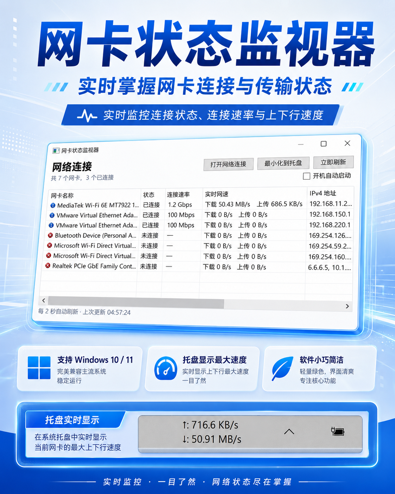
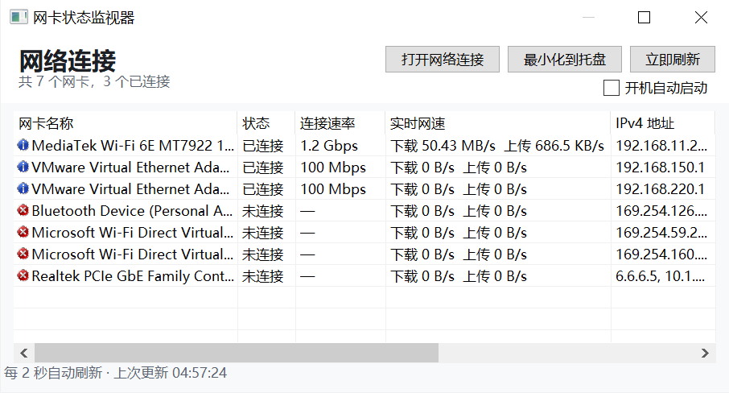

# 网卡监视器 / Network Adapter Monitor



适用于 Windows 10/11 的轻量桌面工具，用来自动刷新并查看本机每个网卡的连接状态、连接速率、实时网速和 IP 地址。

## 主要功能

- 每 2 秒自动刷新网卡状态，并监听 Windows 网络变化事件。
- 显示网卡名称、状态、连接速率、实时上传/下载速度、IPv4、IPv6、类型、默认网关和 MAC 地址。
- Windows 10 下优先显示网卡硬件描述，例如 Realtek、Intel、HP Ethernet 等，读取不到时自动回退到连接名称。
- 可点击“网卡名称”“连接速率”“实时网速”表头排序。
- 一键打开 Windows 控制面板里的“网络连接”页面。
- 手动点击“最小化到托盘”后，主窗口隐藏，并在任务栏右侧显示实时网速最快的网卡速度。
- 托盘速度显示固定在任务栏隐藏图标箭头左侧，不会因为展开隐藏图标而消失。
- 托盘速度显示会自动匹配任务栏背景色；浅色背景显示黑字，深色背景显示白字。
- 首次运行自动加入当前用户的开机启动项，无需管理员权限。
- 电脑开机自动启动时默认进入托盘状态；手动打开程序时正常显示主窗口。

## 界面预览




## 下载使用

请在右侧或页面下方的 [Releases](https://github.com/wifixshare/network-adapter-monitor/releases/latest) 下载编译好的压缩包。

1. 下载 `Network.Monitor.rar`。
2. 解压到固定目录。
3. 运行解压后的程序。
4. 首次运行后，软件会自动加入当前用户的开机启动项。
5. 点击“最小化到托盘”后，可在任务栏右侧查看实时上传/下载速度。

> 如果电脑未安装 .NET 8 运行环境，请安装 Microsoft .NET 8 Desktop Runtime 后再运行。

## 自行编译

1. 在 Windows 10/11 安装 [.NET 8 SDK](https://dotnet.microsoft.com/download/dotnet/8.0)。
2. 双击 `build-windows.cmd`。
3. 生成的程序位于：

   ```text
   publish\Network Adapter Monitor.exe
   ```

也可以用 PowerShell 编译：

```powershell
powershell -ExecutionPolicy Bypass -File .\build-windows.ps1
```

开发运行：

```powershell
dotnet run --project .\NetworkCardMonitor\NetworkCardMonitor.csproj
```

## 隐私和权限

网卡监视器只读取本机 Windows 提供的网卡信息，不连接互联网，也不会上传数据。

开机启动项写入当前用户的 `HKCU` 注册表，因此不需要管理员权限。
